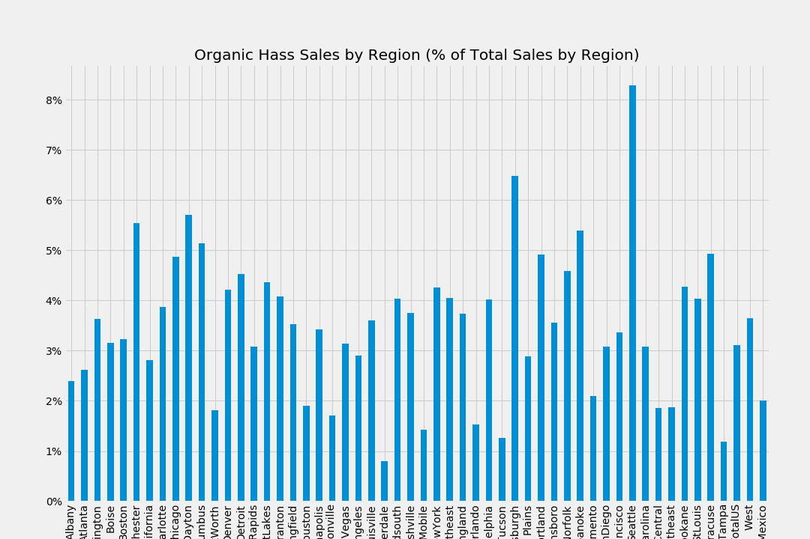
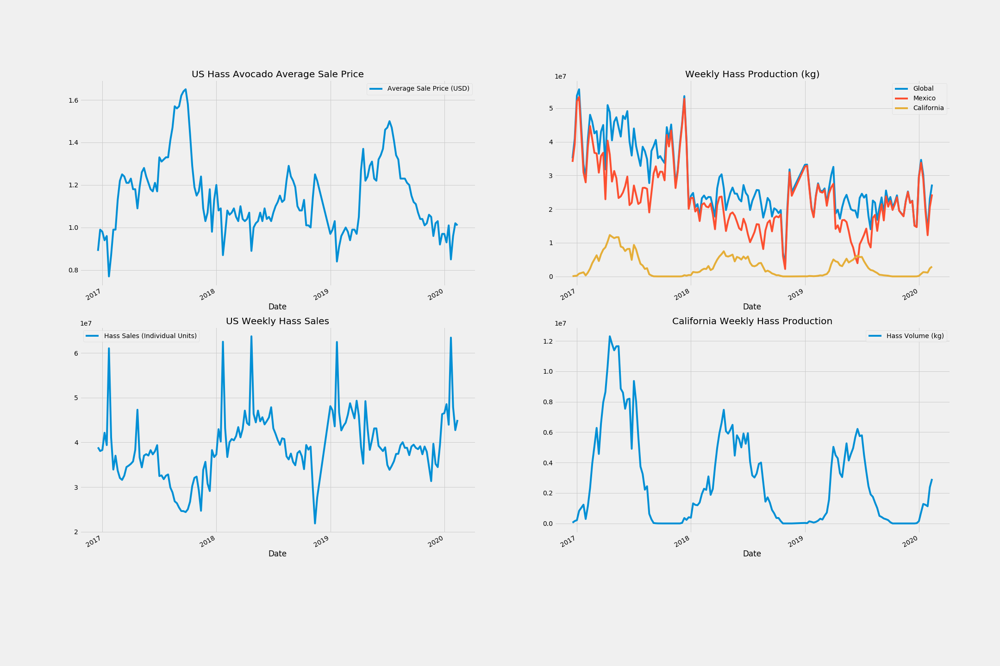
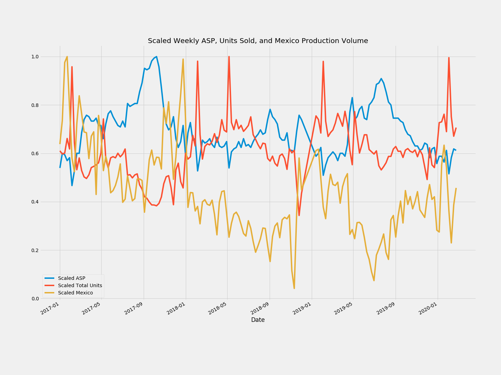
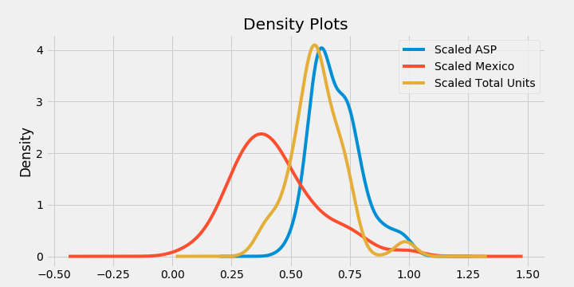
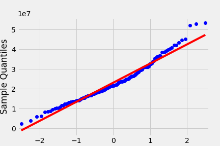

# Mining for Green Gold

#### ***A look at four years of Hass avocado sales and production data.***

#### Derek Schwenkmeyer

## Table of Contents
[1. Background](#background)  
[2. Data](#data)
>[2 i. Feature Exploration](#feature) 
    
[3. Hypothesis Testing](#tests)
>[3 i. Questions](#questions) 
>[3 ii. Results](#results) 

[4. Future Direction](#future)

## Background:

***
***
Since it first came into being in La Habra Heights, CA in 1935, the Hass avocado has taken the world by storm. The US alone has a nearly three-billion dollar Hass industry. The green, pitted fruit is renowned for it's creamy texture, high nutrient density, and overall deliciousness.

However, like all things from California, the "alligator pear" has a dark side. Avocado-mania has led to [an epidemic of avocado-related hand injuries](https://www.ajemjournal.com/article/S0735-6757(19)30446-2/fulltext), mustachioed actor Tom Selleck [stealing his neighbor's water](https://www.telegraph.co.uk/culture/tvandradio/11728356/How-Tom-Selleck-got-into-hot-water-over-avocados.html), and, most famously, avocado toast addiction is by far the number one factor [preventing millenials from becoming homeowners](https://www.washingtonpost.com/news/food/wp/2017/05/15/dont-mess-with-millennials-avocado-toast-the-internet-fires-back-at-a-millionaire/).

Luckily for us, the [Hass Avocado Board](https://hassavocadoboard.com/) has generously provided the last four years of US Hass retail sales and global Hass production volume data. We have a chance to crunch the numbers, spot the trends, corral the correlations, and ultimately understand what drives the [imposing economics of Big Hass](https://money.cnn.com/2017/09/09/news/economy/avocado-prices-soar/index.html), before the bubble bursts. 

## Data

***
***
Data was [provided by the Hass Avocado Board (HAB)](https://hassavocadoboard.com/) in the form of eight CSVs. 

Four of the files are made up of the HAB's "Weekly Retail Volume & Price Reports" from 2017 through March 2020. There are 18K rows, and columns include:

    ['Geography', 'Timeframe', 'Current Year Week Ending', 'Type', 'ASP Current Year', 'Total Bulk and Bags Units', '4046 Units', '4225 Units', '4770 Units', 'TotalBagged Units', 'SmlBagged Units', 'LrgBagged Units', 'X-LrgBagged Units']

"ASP" stands for Average Sale Price (of an individual Avocado), and 4046, 4225, and 4770 are the PLU numbers of different sized avocados.

The other four files are comprised of the HAB's "Volume Data 7 Day Projections" report. There are 195 rows, and columns include:

    ['Week', 'Status', 'Total Volume', 'California', 'Chile', 'Mexico', 'Peru', 'Colombia']
    
The "Total Volume" column and columns named after places all include Hass avocado production volume, in kg.

For further analysis, I have included data from the HAB's "Weekly Retail Volume & Price Reports" from 2015-2018, which was pulled previously and [posted on Kaggle](https://www.kaggle.com/neuromusic/avocado-prices).

### Feature Exploration

After cleaning and joining the data, I started to narrow down the data to get to the most significant pieces. Half of the rows of retail data were concerning Organic avocado sales, so I took a look at that first.

While there are a few regions that have more Organic avocado sales than others, it is always a relatively minor slice of the total sales. I focused on Conventional avocado sales for the rest of the analysis.

Three features stand out as interesting to test for correlation: unit sales, average sale price (ASP), and production volume.

I started by plotting the weekly unit sales and ASP for the entire US. I compared the trends to production volume for the whole world, Mexico, and California.

I chose to look at Mexico and California production volume because they are the top two providers of avocados to the US, with Mexico supplying 80%, and California supplying 10%. This chart makes it clear that Mexico is the Hass hub of the entire world. I will continue the analysis using Mexico production volume only, because these charts make it clear that Mexican avocados play the biggest role in Hass economics in the US.

After deciding to initially focus on Mexican avocado production, I scaled the ASP, sales, and production data to compare trends side-by-side:

In this plot, it appears that these variables may be correlated.

## Hypothesis Tests

***
***

#### Question 1 : Does the price of avocados affect sales volume?

+ Null Hypothesis: ASP and Hass unit sales are independent.

+ Alternate Hypothesis: ASP and Hass unit sales are correlated.

#### Question 2 : Does Mexico's production volume affect Hass ASP in the US?

+ Null Hypothesis: Production volume and ASP are independent.

+ Alternate Hypothesis: Production volume and ASP are correlated.

Pearson's r tests will work for testing all of these hypotheses. A requirement of the test is normality, so let's take a look at the distributions of the scaled variables first.

These all look fairly normal. Mexico's production volume is the most skewed- let's take a look at the QQ plot to see if it reveals anything else about the normality.

It still looks fairly normal. Let's proceed with the tests. We have enough data that we should be able to be fairly confident in our results, so let's set our alpha to 0.01.

#### Test 1 Results

    pearsonr(conv_us_vol_rtl['ASP'], conv_us_vol_rtl['Total Units'])
   
Results: r = -0.71, p = 1.7 * 10^-25

We reject the null. Data suggests that there is a strong negative correlation between price and consumption. This appears to be textbook supply/demand economics.

#### Test 2 Results

    pearsonr(conv_us_vol_rtl['ASP'], conv_us_vol_rtl['Mexico'])
    
Results: r = -0.10, p = .20

We fail to reject the null. Next steps in this analysis will be to look for time-lagged cross-correlation, as it seems likely that there would be a time delay of around a week between when the avocados are produced and when they affect market prices.

## Future Direction:

***
***
The immediate next step in this analysis needs to be looking for a possible time-lagged cross-correlation between Mexico's Hass production volume and US average sale price. If such a correlation exists, one could ****predict the future**** of avocado prices. Why leave the house if avocados are going to be three dollars a piece?

Seasonality also plays a huge role in the features analyzed here. Adjusting the data based on these seasonal trends is some low-hanging fruit that would be useful in any further analysis.

There are many other interesting questions that could be explored with this dataset. Does the price difference between conventional and organic avocados play a role in how many organic avocados are purchased? Do Californians eat more avocados during California's avocado season, or during Mexico's? Is there *anywhere* in the US where a millenial can afford both avocado toast, and a house??

Take a look, and you just might find out.

Hassta la vista!